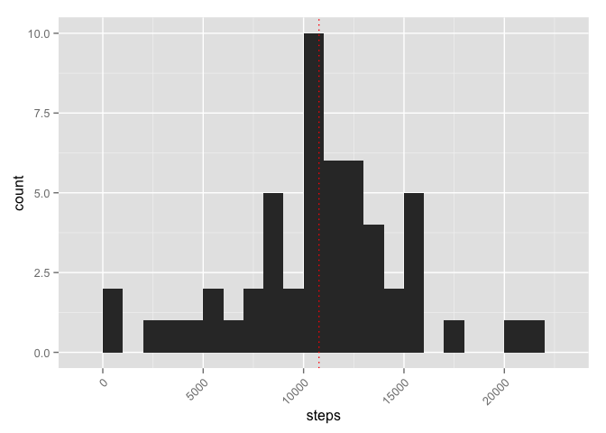
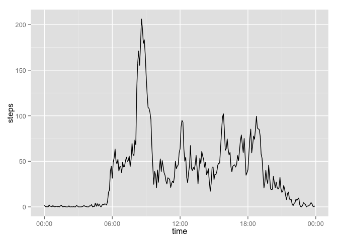
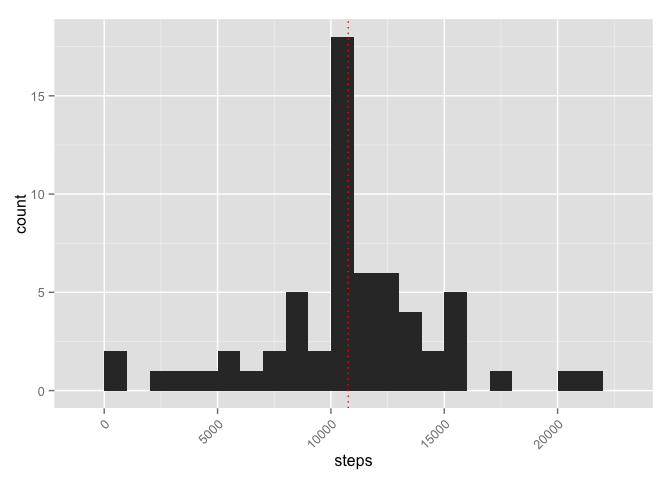
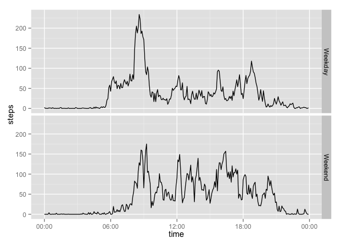

# Reproducible Research: Peer Assessment 1


## Loading and preprocessing the data
Load the "activity.csv" dataset and take a peek at the data

```r
library(dplyr)
library(ggplot2)
library(timeDate)
library(scales)
activity <- read.csv("activity.csv")
head(activity)
```

```
##   steps       date interval
## 1    NA 2012-10-01        0
## 2    NA 2012-10-01        5
## 3    NA 2012-10-01       10
## 4    NA 2012-10-01       15
## 5    NA 2012-10-01       20
## 6    NA 2012-10-01       25
```

Convert 'interval' column to a usable time & add a weekday/weekend flag

```r
activity <- activity %>%
    # pad leading zeros
    mutate(time = formatC(interval, width=4, flag="0"), 
           part_of_week = ifelse(isWeekday(date), "Weekday", "Weekend")) %>%
    # insert a colon
    mutate(time = paste(substr(time,1,2), substr(time,3,4), sep = ":")) %>%
    select(steps, date, time, part_of_week)
head(activity)
```

```
##   steps       date  time part_of_week
## 1    NA 2012-10-01 00:00      Weekday
## 2    NA 2012-10-01 00:05      Weekday
## 3    NA 2012-10-01 00:10      Weekday
## 4    NA 2012-10-01 00:15      Weekday
## 5    NA 2012-10-01 00:20      Weekday
## 6    NA 2012-10-01 00:25      Weekday
```
## What is mean total number of steps taken per day?
Aggregate the steps into daily bins & calculate mean/median.

```r
daily <- activity %>% group_by(date) %>%
    summarize(steps = sum(steps))
daily_summary <- as.integer(c(mean(daily$steps, na.rm=TRUE), median(daily$steps, na.rm=TRUE)))
```

The daily mean is **10766**. The daily median is **10765**. These data are well distributed.


```r
ggplot(daily, aes(x = steps)) +
    geom_histogram(binwidth = 1000) +
    theme(axis.text.x = element_text(angle=45, hjust = 1, vjust = 1)) +
    geom_vline(xintercept = daily_summary[1], color="red", linetype = "dotted")
```

 


## What is the average daily activity pattern?
Quick plot of average hourly steps...

```r
typical_day <- activity %>% group_by(time) %>%
    summarize(steps = mean(steps, na.rm=TRUE))
ggplot(typical_day, aes(y = steps, x = strptime(time,'%H:%M', tz = "UTC"))) +
    geom_line() +
    scale_x_datetime(labels = date_format('%H:%M', tz = "UTC")) +
    labs(x = "time")
```

 

```r
typ_day_max = typical_day[which.max(typical_day$steps),]
```
The highest average step count is **206** at hour **08:35**.

## Imputing missing values
There are a total of **2304** NA values in the 'steps' column of the original dataset.

Let's remove these NA's by replacing them with the interval averages...

```r
activity_noNA <- activity %>%
    left_join(typical_day, by = "time") %>%
    mutate(steps = ifelse(!is.na(steps.x), steps.x, steps.y)) %>%
    select(steps, date, time, part_of_week)
```

Aggregate this modified dataset's steps into daily bins & calculate mean/median.

```r
daily <- activity_noNA %>% group_by(date) %>%
    summarize(steps = sum(steps))
daily_summary <- as.integer(c(mean(daily$steps, na.rm=TRUE), median(daily$steps, na.rm=TRUE)))
```

The new daily mean is **10766**. The daily median is **10766**. This is equivalent to the set above. This means that the NA's in the original dataset are distributed in such a way as not to disturb the median when substituted with average values.


```r
ggplot(daily, aes(x = steps)) +
    geom_histogram(binwidth = 1000) +
    theme(axis.text.x = element_text(angle=45, hjust = 1, vjust = 1)) +
    geom_vline(xintercept = daily_summary[1], color="red", linetype = "dotted")
```

 

This histogram is similar to the one above, but with a significantly strengthened center frequency.

## Are there differences in activity patterns between weekdays and weekends?
Another quick plot of average hourly steps, this time separating out the weekends...

```r
typical_day_2 <- activity %>% group_by(part_of_week, time) %>%
    summarize(steps = mean(steps, na.rm=TRUE))
ggplot(typical_day_2, aes(y = steps, x = strptime(time,'%H:%M', tz = "UTC"))) +
    geom_line() +
    facet_grid(part_of_week~.,space="free") +
    scale_x_datetime(labels = date_format('%H:%M', tz = "UTC")) +
    labs(x = "time")
```

 

### One could surmise that the evaluatees tended change their activities a bit on the weekend by:  
* Sleeping in a bit  
* Having a lower peak activity level (especially at 8:30AM)  
* Having a higher overall activity level (especially after lunch)
